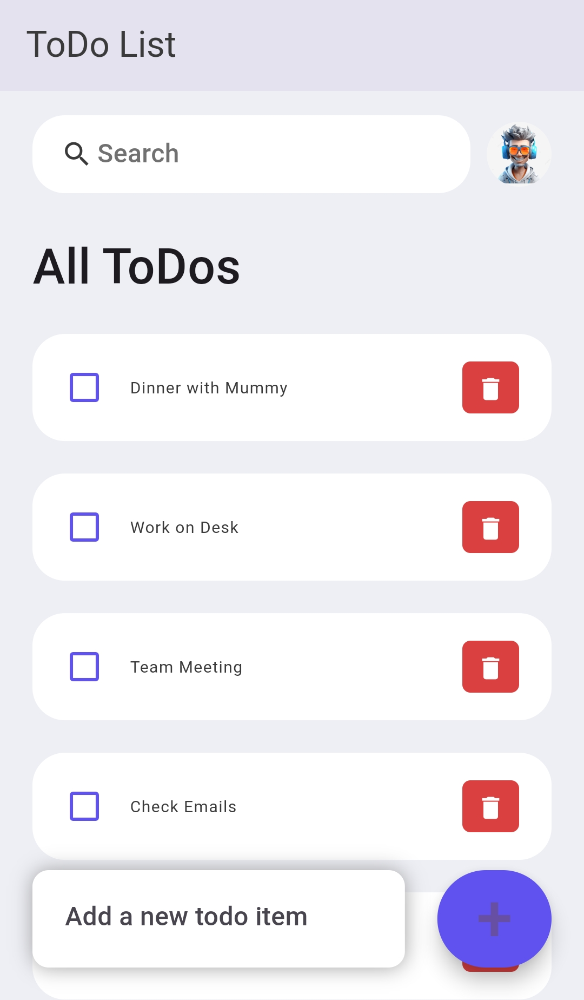
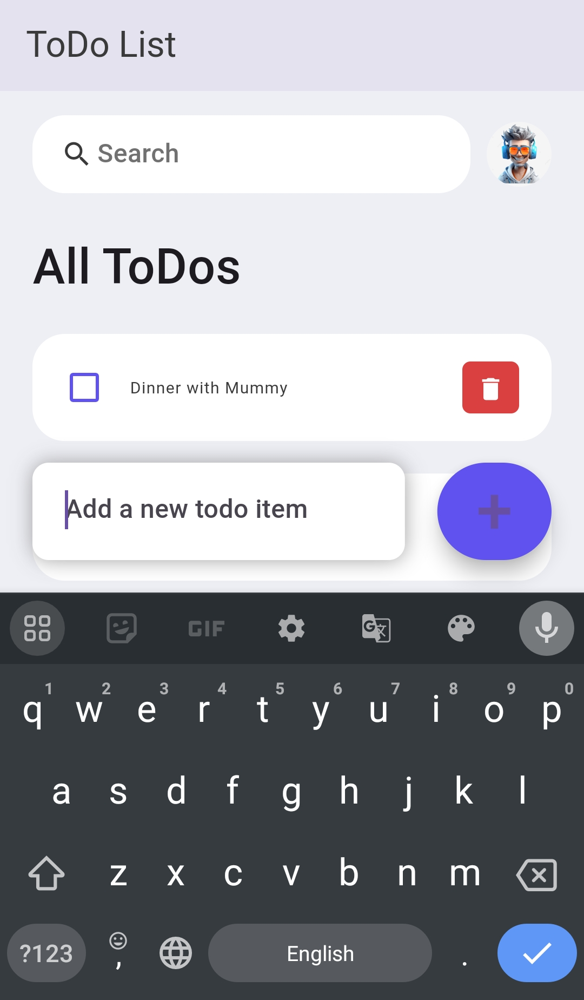

# ToDo App

ToDo App is a task management Flutter application designed to help users stay productive by organizing their daily tasks. The app is simple yet powerful, allowing users to create, update, and manage tasks with ease.


# Features ✨

* ✅ Task Creation: Easily add new tasks.
* ✏️ Task Editing: Modify existing tasks when priorities change.
* 🗑️ Task Deletion: Remove completed or irrelevant tasks.
* 📅 Due Dates: Assign deadlines and prioritize tasks.
## Screenshots 📷



## Prerequisites 🛠️


* Flutter SDK: Ensure that Flutter is installed. If not, follow the instructions at Flutter installation.
* Android/iOS Device or Emulator: Use a real device or an emulator for development and testing.
## Getting Started 🚀

1. Clone the Repository:

```
git clone https://github.com/yourusername/todoapp.git
cd todoapp

```

2. Install Dependencies:

```
flutter pub get

```

3. Run the App:

```
flutter run

```
## Usage 📖

* Open the ToDo App.
* Add new tasks by tapping the + button.
* Assign a deadline and category (optional) to each task.
* Mark tasks as completed when finished or delete them if no longer needed.
## Dependencies 📦


* provider: For managing state within the app.
* shared_preferences: To persist tasks locally on the device.
* flutter_local_notifications: To remind users of upcoming tasks.
* intl: For date formatting and localization.
## Upcoming Features 🔮

 * Cloud sync to allow access across multiple devices.
 * Task prioritization with color-coded importance levels.
 * Task sorting by deadlines or categories.
